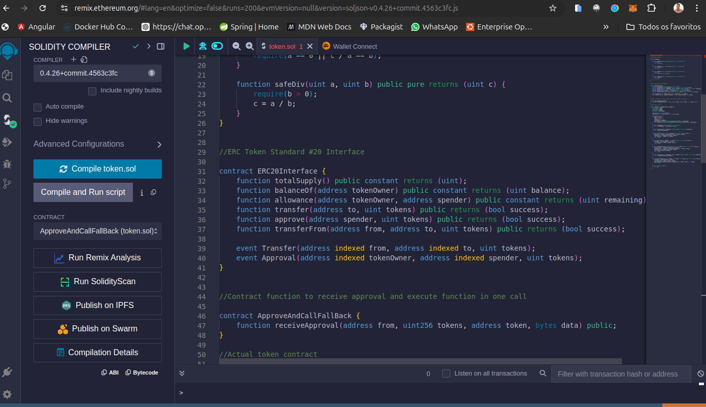
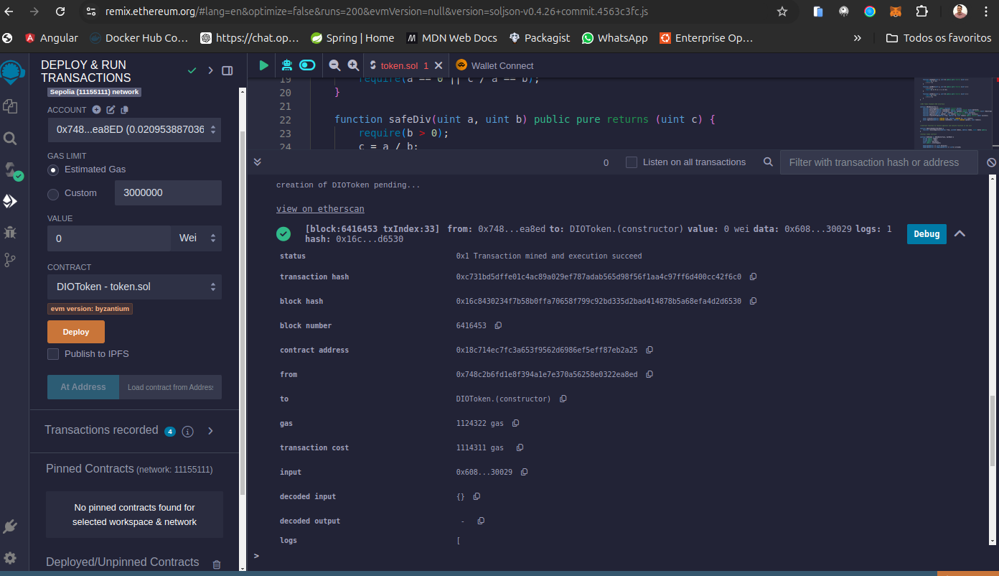
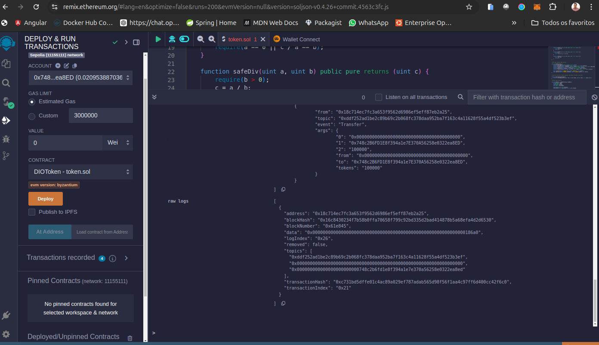
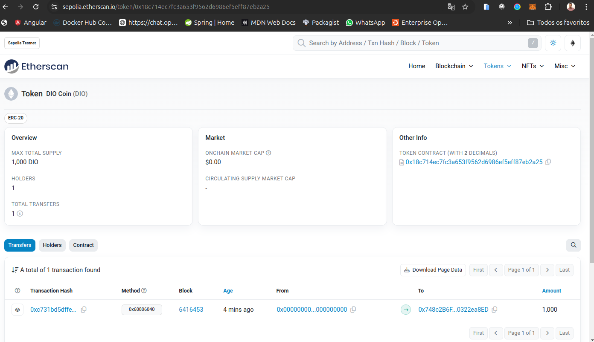
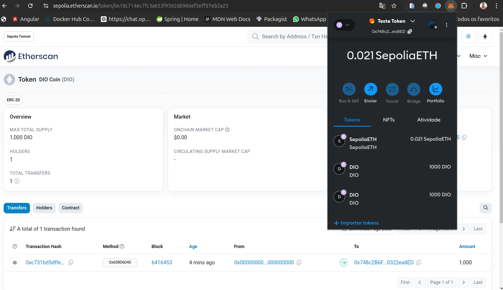

# Criando Token do Zero nso Padrões WEB3

- no smart-contract-token.sol está o código com a carteira para a crianção do token.

- para conseguir o gás para a transação utilizeio o site https://cloud.google.com/application/web3/faucet/ethereum/sepolia

- Após confilado o arquivo. 
- Realizado o deploy.  e 
- confirmando a transação. 
- transação na ethereumscan. 
- a transação não apareceu diretamente na carteira, logo, atraves do token contract (0x18c714Ec7FC3A653f9562D6986eF5Eff87EB2a25) importei na carteira da MetaMask. 

#####Obs.: realizei o procedimento duas vezes e as duas derem certo, e acima está somente a transação da segunda tentativa.